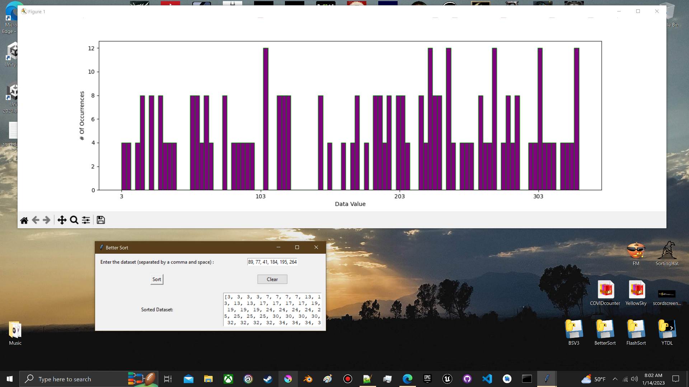

BetterSort V3.0 

BetterSort V3.0 offers new functionality in that now a histogram of data is displayed along with the sorted array.

This is a simple python script utilizing the BetterSort Algorithm, a modified Flash Sort. 

<b><i><u>**HOW TO**</b></u></i> In your command console, run this command in the directory where you saved BSV3.py:
pyinstaller BetterSort.py --onefile -w
This will create a standalone .exe that will open a TKinter window with a GUI for inputting data sets. Please make sure all numbers are separated with a comma then space. Use the clear button before entering new data. After the data is sorted, a text file named sorted data will be created in the folder where the .exe is run from.

BetterSort uses a sorting algorithm that is based on the idea of partitioning the array into a number of segments, and then sorting the elements within each segment using a standard sorting algorithm such as quicksort. It combines the advantages of both distribution sorting and partition sorting, it's an efficient sorting algorithm based on a modified flash sort.

It is efficient for data sets that have a high degree of non-uniformity, meaning that the elements in the data set are not evenly distributed. For example, It can be useful for sorting large data sets with a histogram-like distribution, where most of the elements are concentrated in a small range of values, but there are also a few elements that are much larger or smaller than the rest. This is because the algorithm uses the histogram-like distribution to quickly identify and sort elements that are similar in value, while also using quicksort to efficiently sort the elements that are not similar in value.

The time complexity of better sort is O(n log n) in the average and worst case scenario.

Additionally, the space complexity of better sort is O(n).

I have included 3 sets of randomly generated test data that can be used to test the quality and efficiency of the algorithm and script.
